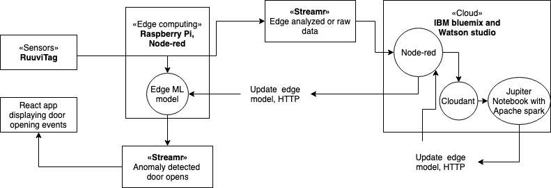
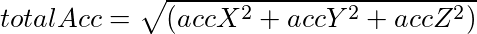
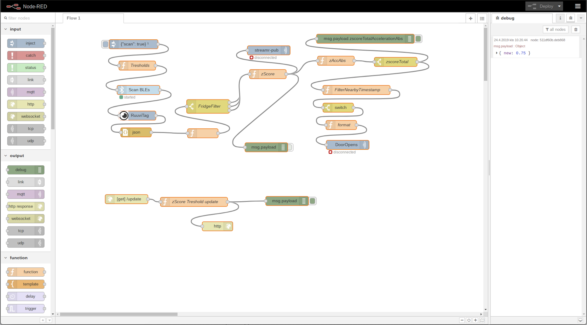
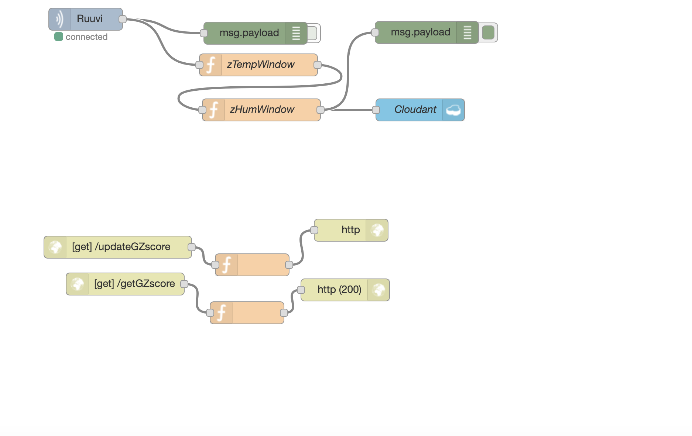
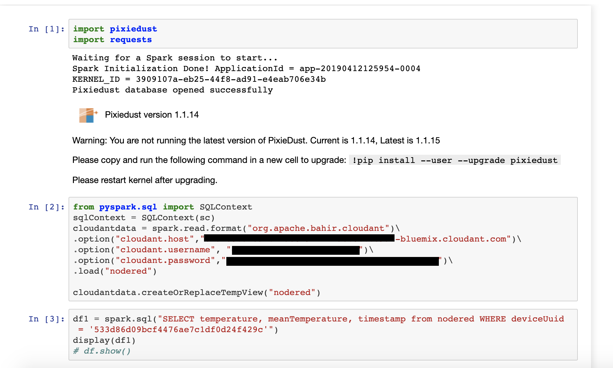
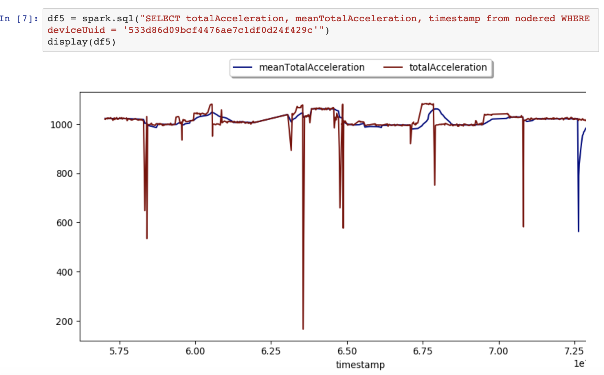

# Cognitive IoT fridge Streamr implementation with RuuviTags, Raspberry Pi, Node-Red and IBM's Bluemix and Watson Studio

This repository contains the source code to a React app to display door opening events of the fridge door. The Node-Red flows in the Raspberry Pi and IBM's bluemix are also provided. The rest of the architecture and how to set it up is also documented.



# Setting up the edge of the architecture
## Sensors
The sensors used in the fridge are two [RuuviTag](https://ruuvi.com/) sensor attached to the fridges door. The RuuviTags meassure air pressure, temperature, humidity, and acceleration of the x, y and z axis. The RuuviTags send data in one second intervals via Bluetooth LTE. The acceleration axis can be easily aggregated to calculate the total g-force of the RuuviTag with the formula:



as JavaScript:

```javascript
const totalAcc = Math.sqrt(
    Math.pow(accelerationX,2) + 
    Math.pow(accelerationY,2) + 
    Math.pow(accelerationZ,2)
)
```

From the total G-force a sliding z-score anomaly detection algorithm is implemented. The Algorithm has a window of 60 which roughly corresponds to one minute's wirth of data points. The Node-Red flow then filters the data points with a z-score that is higher than 0.5 by default. This threshold can be altered after a cloud connection is made by sending API requests to the cloud's Node-Red instance.

## Edge gateway

The edge gateway device used in this architecture was a Raspberry Pi 3b+. The Raspberry Pi requires some extra configuration to get Node-Red to receive the bluetooth LTE data.

First you need to make sure that you have Node version 8.x installed on your Raspberry Pi. There are issues with the Noble library used in the flow to get the Ruuvi data on later versions. Node v8.11.1 was used on our offices Raspberry Pi. It's also worth noting that using nvm did not do the trick, and you might need to reinstall node on the correct version completely.

[Here's](https://github.com/ojousima/node-red) a guide on how to set up your Node-Red flow to receive Ruuvi data.

After the RuuviTags are connected It's time to install Streamrs Node-Red library. You can find it by going to settings -> manage pallette -> install -> search for Streamr and install the node-red-contrib-streamr library. Now you should be able to pull the Streamr subscribe and publish node to the flow.

You should also set up a stream in [Stream's editor](https://www.streamr.com). First if you haven't already, you need to set an account on Streamr. Then you can create a Stream by going to core -> Streams. Now you can find your Streamr API key in your Streamr profile, and your Streams ID by selecting your new stream. The API key and stream ID should then be passed in Node-Red to the Streamr nodes in their confoguration tab. You can also set up a second stream for publishing door events. The React App subscribes to that stream.

You can import the entire flow used in the edge from [the flows directory](./flows)



The flow has two end nodes that publish to Streamr. First one in the flow publishes the raw data + the aggregated acceleration data to a Stream that is connected to IBM's bluemix. The second one publishes the data points that correspond to the fridge's door being opened.

There are a lot of functions and switches in the flow. You can dive deeper into the functions in Node-Red for more info on those. The node named zScore does the acceleration data aggregations and handles the sliding z-score algorithm.

# The cloud

## IBM Bluemix
IBM's Bluemix and Watson studios free versions were used for this architecture. There is another Node-Red instance running in the cloud. Node-Red and Cloudant can be easily set up in Bluemix by following the instructions in this [video](https://www.youtube.com/watch?v=Tk0sHowF3I0). You also need to install Streamr's Node-Red library for this instance. After everything is set up you can import the [cloud flow](./flows) and connect the subscribe node to the stream that publishes the raw data from the edge.



The cloud flow calculates sliding z-scores for temperature and humidity aswell. The z-score isn't that important here but sliding averages are also aggregated within the algorithm for later data analysis. Finally the data is pushed to Bluemix's CouchDB database, Cloudant. 

The cloud flow has a small API set up for updating the z-score threshold in the cloud. You can call it with:

```
{node-red-instance-base-url}/updateGZscore?new=0.5
```


## Watson Studio
IBM's Watson Studio offers many solutions for data science. I used the Jupyter Notebook instance with spark, that can be very easily be used to visualize and explore data, and even do some heavier analytics with Spark. IBM offers some free credits monthly so you can try out spark without worries.

To connect your cloudant database to Notebook you should first set up some read keys for your Cloudant database. The image below shows how connect Notebook with Spark to Cloudant. You should also import the pixiedust library if you wish to do data visualization.



And lastly here is an example on how to do data visualization, and why the sliding z-score algorithm works (most of the time) for this use case.


You can also do hhtp requests to the cloud's Node-Red instance from Notebook. You could use this to pass ML model updates to the cloud and the edge. The edge flow does periodic requests to the cloud instance to update the zScores threshold. You could implement a similar pipeline for more Machine learning heavy use cases. This way you could do fast decisions on the edge based on machine learned models, and act out the decisions by actuators to the real world.

All in all, the architecture is a working PoC pipeline of using Streamr in a cognitive IoT architecture. Any further developement ideas for this use case are welcome.